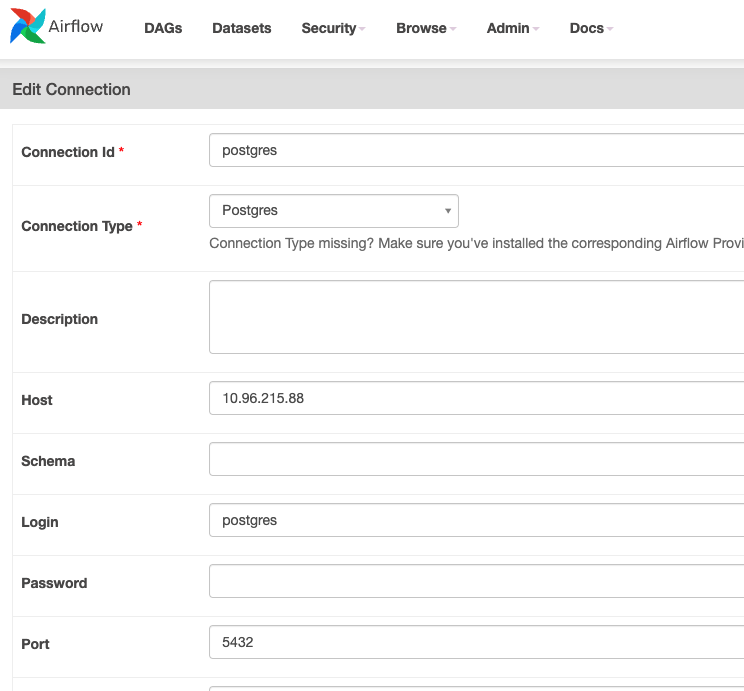
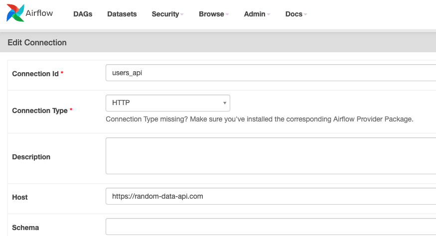
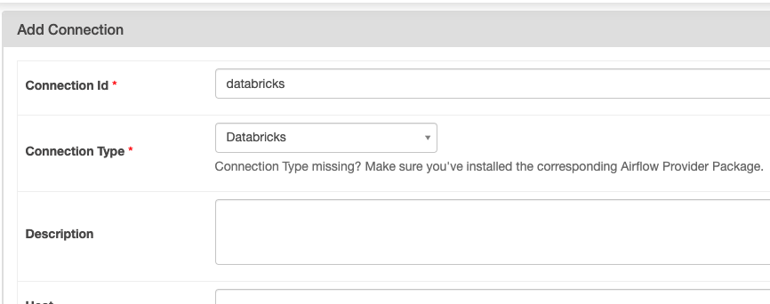
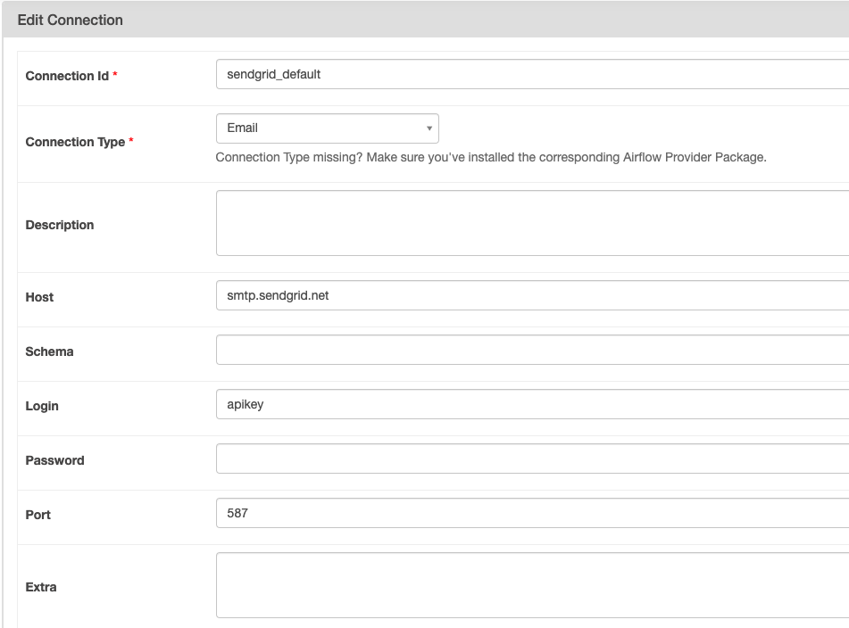

# DAGs

## Create Connections
Everytime an external service is used in a task, it means that an external connection
needs to be created.

##### - Postgres -

Given that the postgres database is in one of the pods, then we need to look for what is the host:
```commandline
kubectl get services -n airflow  
```
result:
```
NAME                    TYPE        CLUSTER-IP     EXTERNAL-IP   PORT(S)             AGE
airflow-postgresql      ClusterIP   10.96.73.68    <none>        5432/TCP            36m
airflow-postgresql-hl   ClusterIP   None           <none>        5432/TCP            36m
airflow-redis           ClusterIP   10.96.77.93    <none>        6379/TCP            36m
airflow-statsd          ClusterIP   10.96.130.42   <none>        9125/UDP,9102/TCP   36m
airflow-webserver       ClusterIP   10.96.135.39   <none>        8080/TCP            36m
airflow-worker          ClusterIP   None           <none>        8793/TCP            36m
```



##### - API -


##### - Databrics -



##### - Sendgrid -



